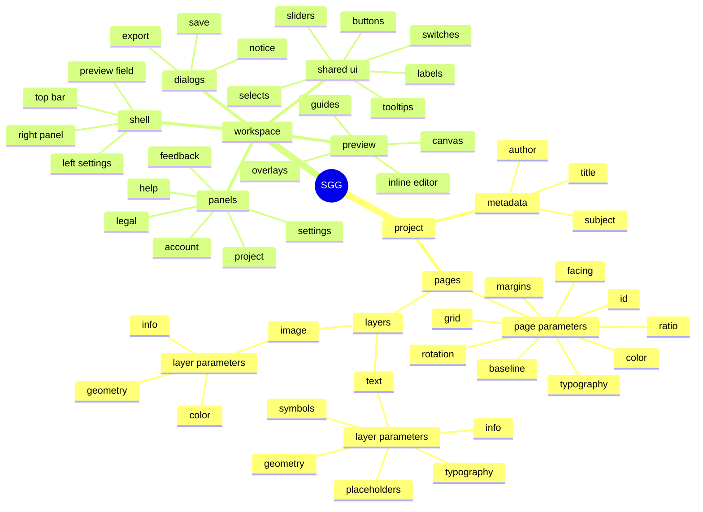
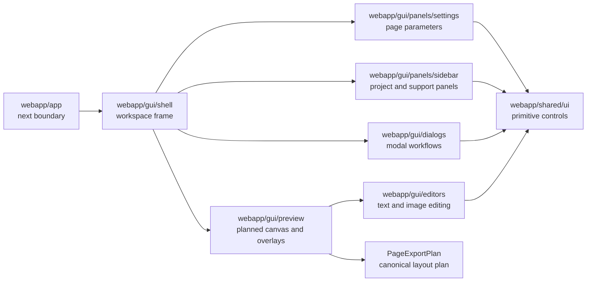

# GUI Interface Map

## Purpose

`GUI.md` is the handoff map for GUI design and implementation. It defines the current interface as a precise component system: information hierarchy, workspace regions, component inventory, expected states, and code ownership.

The interface is a professional typography instrument. The GUI must support exact composition, deterministic preview, and calm repeated use. It must not behave like a generic design canvas or marketing interface.

`PageExportPlan` remains the source of truth for layout. Preview, thumbnails, PDF, SVG, and IDML consume the same plan. GUI components may expose controls and render planned output; they must not create a second layout model.

## Visual System Rules

- Use structure before decoration.
- Every stroke, border, icon, color, and divider must have a functional reason.
- Use color only for state, action, warning, selection, or status.
- Keep spacing aligned to the 8px / 4px interface rhythm.
- Keep controls stable; hover previews must not create layout jumps.
- Author UI copy in normal sentence/label case: labels, buttons, help text, tooltips, and status messages.
- Apply lowercase presentation in the GUI through CSS, not by lowercasing source strings.
- Preserve required source casing for file formats, code identifiers, keyboard shortcuts, serialized values, and imported names.
- Use sharp geometry, restrained borders, and flat tactile surfaces.
- Avoid decorative gradients, gloss, arbitrary shadows, large rounded containers, and ornamental imagery.

## Information Architecture

## Workspace Regions

| Region | Purpose | Visible components | Expected states | Interaction notes | Code ownership |
|---|---|---|---|---|---|
| top bar | global workspace commands and display toggles | file actions, undo/redo, display toggles, sidebar toggles, account, more menu | default, active, disabled, synced, unsynced, hover, focus | icons carry the command; tooltips provide names and shortcuts when information is active | `webapp/gui/shell` |
| left settings panel | page-level parameters for the active page | ratio, orientation, baseline, margins, grid, typography, color | collapsed, expanded, hover-preview, committed, disabled while unavailable | dropdown/list hover may preview values and must restore committed state on close | `webapp/gui/panels/settings` |
| preview canvas | planned page rendering and direct manipulation | page, baselines, margins, modules, typography guides, image placeholders, hover affordances | loading, ready, editing, dragging, zoomed, locked layer hover, hidden during page settle | renders planned geometry; does not own layout calculation | `webapp/gui/preview` |
| right project panel | project structure, pages, layers, metadata, support panels | title, metadata, page list, layer list, help, feedback, account, legal notice | closed, open, active page, opened page row, selected layer, locked layer, sync states | only one right panel is active at a time; layer rows mirror preview selection | `webapp/gui/panels/sidebar` |
| editors | focused layer editing | text editor panel, image editor panel, inline textarea, section controls | open, closed, retargeted, dirty draft, committed, locked-disabled | editor state must preserve the active layer contract and avoid outside-pointer loss | `webapp/gui/editors` |
| dialogs | blocking or export/save workflows | save library, export, notice, export preview | idle, confirming, exporting, cancellable, error, success | modal surfaces are functional tools, not decorative cards | `webapp/gui/dialogs` |

## Component Inventory

### Shell Components

| Component | Design responsibility | Path |
|---|---|---|
| shell | overall workspace composition and state handoff | `webapp/gui/shell/Shell.tsx` |
| top bar | compact icon-command row, status dots, menu entry points | `webapp/gui/shell/TopBar.tsx` |
| left toolbar | left-side settings container placement | `webapp/gui/shell/LeftToolbar.tsx` |
| right panel | right-side panel placement and width rhythm | `webapp/gui/shell/RightPanel.tsx` |
| canvas container | preview workspace mount point | `webapp/gui/shell/CanvasContainer.tsx` |

### Preview Components

| Component | Design responsibility | Path |
|---|---|---|
| grid preview | production interaction canvas and preview orchestration | `webapp/gui/preview/GridPreview.tsx` |
| canvas stage | canvas stack, inline editor position, and help line placement | `webapp/gui/preview/GridPreviewCanvasStage.tsx` |
| overlays | text/image editor overlays and active editor panels | `webapp/gui/preview/GridPreviewOverlays.tsx` |
| feedback | transient preview warnings and status messages | `webapp/gui/preview/GridPreviewFeedback.tsx` |
| preview workspace | page field plus side panels and project overlays | `webapp/gui/preview/PreviewWorkspace.tsx` |
| swiss canvas | plan-only canvas foundation | `webapp/gui/preview/SwissCanvas.tsx` |

### Settings Panels

| Component | Design responsibility | Path |
|---|---|---|
| settings shell | left panel section order and collapsed/open behavior | `webapp/gui/panels/settings/SettingsSidebarPanels.tsx` |
| panel card | section container, header, help affordance, divider rhythm | `webapp/gui/panels/settings/PanelCard.tsx` |
| canvas ratio | ratio, orientation, and rotation controls | `webapp/gui/panels/settings/CanvasRatioPanel.tsx` |
| baseline | baseline value control and unit display | `webapp/gui/panels/settings/BaselineGridPanel.tsx` |
| margins | margin method and custom multiplier controls | `webapp/gui/panels/settings/MarginsPanel.tsx` |
| grid/gutter | grid density, rhythm, direction, and gutter controls | `webapp/gui/panels/settings/GutterPanel.tsx` |
| typography | base font, scale rhythm, and hierarchy overview | `webapp/gui/panels/settings/TypographyPanel.tsx` |
| color | base scheme and page background controls | `webapp/gui/panels/settings/ColorSchemePanel.tsx` |

### Sidebar Panels

| Component | Design responsibility | Path |
|---|---|---|
| pages panel | page list, page controls, layer entry points | `webapp/gui/panels/sidebar/PagesPanel.tsx` |
| layer list | text/image layer rows, locking, deletion, reordering | `webapp/gui/panels/sidebar/ProjectPageLayersList.tsx` |
| project title | compact title, metadata opening, close affordance | `webapp/gui/panels/sidebar/ProjectTitleSection.tsx` |
| metadata | title, subject, author fields | `webapp/gui/panels/sidebar/ProjectMetadataSection.tsx` |
| presets | preset and user layout browser | `webapp/gui/panels/sidebar/PresetLayoutsPanel.tsx` |
| account | auth and sync state surface | `webapp/gui/panels/sidebar/AccountPanel.tsx` |
| documentation | discreet external documentation link | `webapp/gui/shell/TopBar.tsx` |
| feedback | support message and screenshot attachment surface | `webapp/gui/panels/sidebar/FeedbackPanel.tsx` |
| legal | legal notice content | `webapp/gui/panels/sidebar/LegalNoticePanel.tsx` |

### Editor Panels

| Component | Design responsibility | Path |
|---|---|---|
| text editor panel | paragraph, typography, symbols, placeholders, info | `webapp/gui/editors/TextEditorPanel.tsx` |
| image editor dialog | image geometry, color, transparency, info | `webapp/gui/dialogs/ImageEditorDialog.tsx` |
| inline textarea | direct text editing over planned text geometry | `webapp/gui/editors/InlineBlockTextarea.tsx` |
| editor section | shared editor section header and help behavior | `webapp/gui/panels/EditorSidebarSection.tsx` |
| color controls | editor-local color scheme and swatch controls | `webapp/gui/editors/EditorColorSchemeControls.tsx` |

### Dialogs

| Component | Design responsibility | Path |
|---|---|---|
| workspace dialogs | central dialog router for save, export, notices | `webapp/gui/dialogs/WorkspaceDialogs.tsx` |
| save library | local/cloud library metadata workflow | `webapp/gui/dialogs/SaveLibraryDialog.tsx` |
| export | format, metadata, range, bleed, progress, cancellation | `webapp/gui/dialogs/ExportDialog.tsx` |
| export preview | compact export preview canvas | `webapp/gui/dialogs/ExportPreviewCanvas.tsx` |
| notice | confirmation and risk messaging | `webapp/gui/dialogs/NoticeDialog.tsx` |

### Shared Primitives

| Primitive | Design responsibility | Path |
|---|---|---|
| button | command surface and compact action variants | `webapp/shared/ui/button.tsx` |
| header icon button | top bar icon command with tooltip and status dot | `webapp/shared/ui/header-icon-button.tsx` |
| label | form labels and parameter labels | `webapp/shared/ui/label.tsx` |
| select | dropdown and top-opening select behavior | `webapp/shared/ui/select.tsx` |
| slider | numeric continuous or stepped value control | `webapp/shared/ui/slider.tsx` |
| switch | binary setting control | `webapp/shared/ui/switch.tsx` |
| tooltip | hover and focus explanation surface | `webapp/shared/ui/hover-tooltip.tsx` |
| section header row | panel section headline, value, action, status dot | `webapp/shared/ui/section-header-row.tsx` |
| help indicator line | active help marker line | `webapp/shared/ui/help-indicator-line.tsx` |
| font select | grouped font selection control | `webapp/shared/ui/font-select.tsx` |

## Designer Checklist

### Typography

- UI labels and help copy are authored in normal sentence/label case and rendered lowercase by the GUI CSS layer.
- Section headlines may use spacing, weight, and color for hierarchy; casing is still controlled by the GUI CSS layer.
- Hierarchy is built through size, weight, spacing, and baseline alignment.
- Avoid oversized type inside dense panels.

### Spacing

- Align controls to the established panel width and side gutters.
- Use 8px / 4px increments for interface spacing.
- Avoid nested cards; use sections, dividers, and bands.
- Fixed-format controls must have stable dimensions in default, hover, active, and disabled states.

### Color

- One strong accent per screen or context.
- Accent color must indicate action, active state, warning, status, or selection.
- Neutral surfaces carry structure; color does not decorate.
- Dark mode must preserve hierarchy and contrast without adding decorative effects.

### Controls

- Icon buttons are used for global tools and repeated commands.
- Sliders are used for numeric ranges.
- Switches are used for binary settings.
- Open list controls are used where option visibility is part of the workflow.
- Dropdown hover previews must restore the committed value when no option is selected.

### States

- Define default, hover, focus-visible, active, disabled, loading, error, selected, locked, synced, unsynced, and cancellable states where applicable.
- Disabled controls must remain visible enough to explain system structure.
- Locked layers may show guides and unlock affordances but must not expose edit, duplicate, delete, or movement behavior.
- Loading and page transitions must not show provisional geometry.

### Empty, Loading, Error, Disabled

- Empty states should be concise and functional.
- Loading states should preserve layout dimensions.
- Error states must state the condition and the next available action.
- Disabled states must not shift surrounding layout.

## Engineering Ownership

- New GUI code belongs in `webapp/gui/`.
- Reusable primitives belong in `webapp/shared/ui/`.
- Pure domain logic and shared types belong in `webapp/core/`; `webapp/lib/` is reserved for browser adapters, persistence, and export integration.
- Preview components consume `PageExportPlan`; they do not calculate layout independently.
- Export UI passes project snapshots and options to the shared export path; it does not rebuild format-specific layout data.
- `webapp/components/` and `webapp/hooks/` must stay removed. Do not recreate compatibility folders, shims, or imports.
- Do not import from `@/components` or `@/hooks`.

---
**Date:** May 2026

**Version:** 001
