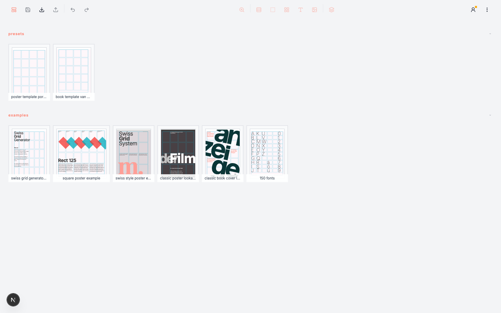
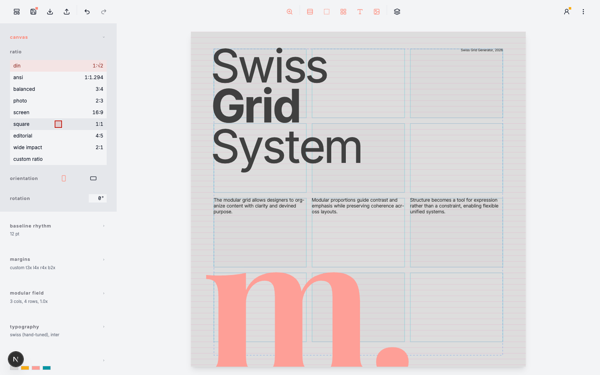
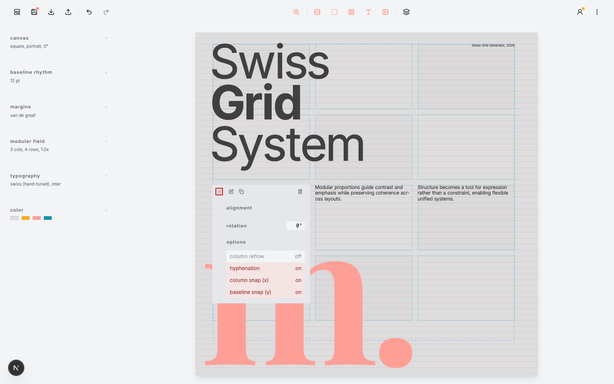

# Swiss Grid Generator

Swiss Grid Generator is a browser-based layout instrument for disciplined editorial design.

Use it to build posters, spreads, books, studies, and visual systems with real typographic structure: ratios, baselines, margins, modular fields, hierarchy, and precise vector export.

[Open Swiss Grid Generator](https://preview.swiss-grid-generator.com)

## Screenshots

## What It Helps You Do

- Start from proven Swiss grid principles instead of a blank canvas.
- Explore page proportion, rhythm, and hierarchy without losing structure.
- Place text and image areas on a clear modular field.
- Work across single pages, facing spreads, and long documents.
- Export clean vector output for PDF, SVG, and IDML workflows.

## Why It Exists

Good layout is easier when the system is visible.

Swiss Grid Generator gives designers a calm workspace for decisions that matter: format, baseline, margins, modules, type scale, and export fidelity. It is designed for people who want clarity, rhythm, and precision without turning the tool into the composition.

## Start In Five Steps

1. Open [preview.swiss-grid-generator.com](https://preview.swiss-grid-generator.com).
2. Choose a preset, or start from a clean page.
3. Set the canvas ratio, baseline, margins, and modular field.
4. Add text and image areas directly on the grid.
5. Export when the page structure is resolved.

For the full guide, read [DOCUMENTATION.md](DOCUMENTATION.md) or the generated documentation site.

## Core Features

| Area | What you can do |
|---|---|
| Canvas | Choose DIN, ANSI, photo, screen, square, editorial, wide, or custom ratios. |
| Baseline | Build vertical rhythm from a shared baseline unit. |
| Margins | Use progressive, Van de Graaf, equal baseline, or custom margin systems. |
| Modular field | Set columns, rows, gutters, and proportional rhythm modes. |
| Typography | Work with structured hierarchy, type rhythm, font families, alignment, tracking, and document variables. |
| Pages | Create single pages, facing spreads, and long multi-page documents. |
| Layers | Place, lock, duplicate, nudge, and refine text and image areas. |
| Export | Save editable project JSON, or export vector PDF, SVG, and IDML. |

For the complete capability inventory, see [FEATURES.md](FEATURES.md).

## A Typical Workflow

- Start with structure: canvas, baseline, margins, and grid.
- Use `Repetitive` rhythm as a neutral control before trying more expressive ratios.
- Add text and image frames only after the page field is clear.
- Use local overrides sparingly.
- Export after checking page order, range, visibility, numbering, and document variables.

The tool follows a simple interaction model:

> Hover. Observe. Commit.

Hover previews help you judge a change before applying it. Click commits the decision.

## Documentation

| Need | Read |
|---|---|
| Learn the design workflow | [DOCUMENTATION.md](DOCUMENTATION.md) |
| See all current capabilities | [FEATURES.md](FEATURES.md) |
| Check exact settings and defaults | [SETTINGS.md](SETTINGS.md) |
| Understand the design principles | [DESIGN.md](DESIGN.md) |
| Preview or build the docs site | [DEVELOPERS.md](DEVELOPERS.md) |

Developer setup, architecture, testing, and recording commands live outside the README:

- [DEVELOPERS.md](DEVELOPERS.md)
- [ARCHITECTURE.md](ARCHITECTURE.md)
- [TESTS.md](TESTS.md)

## License

MIT © [lp45.net](https://lp45.net)
