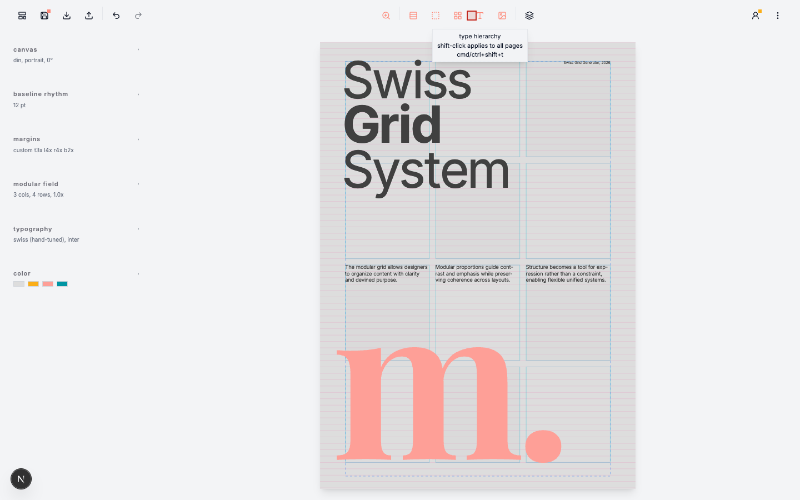
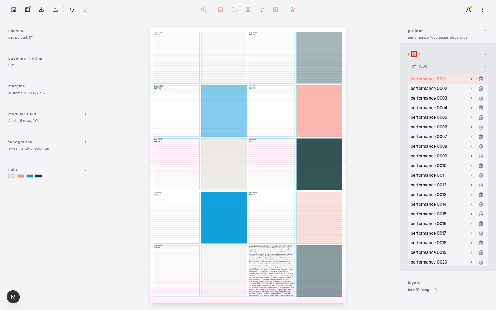
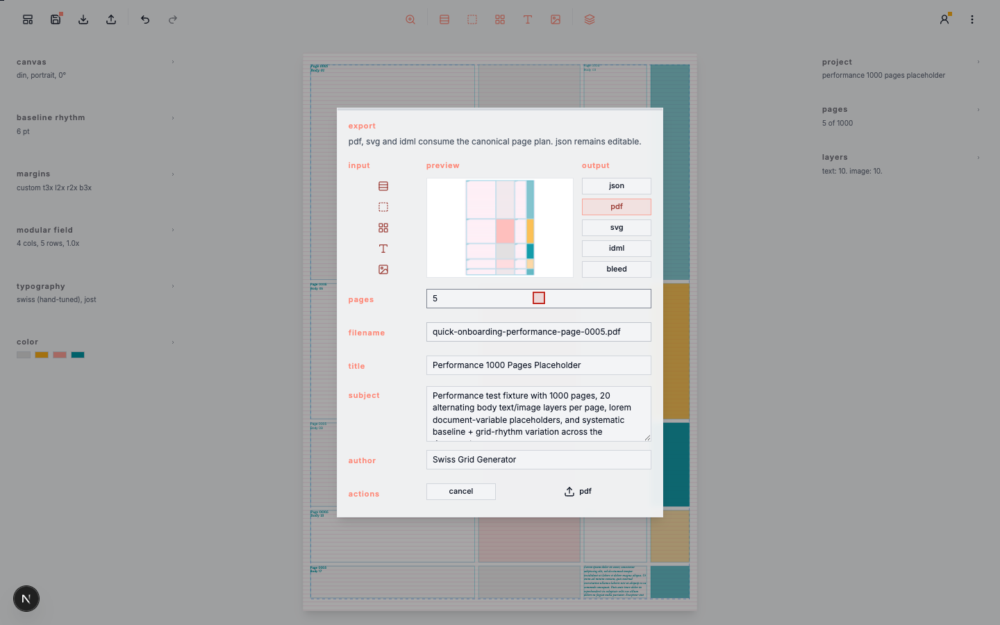
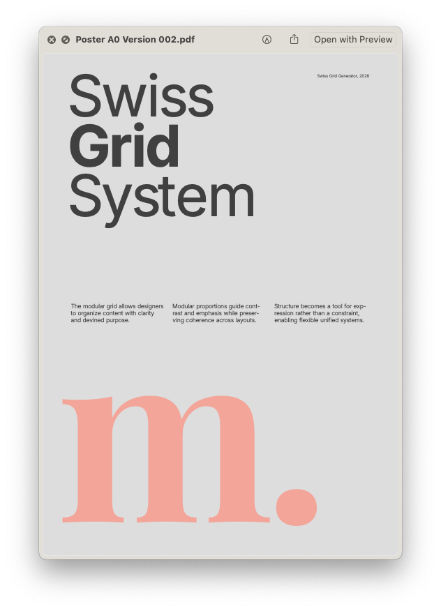

# Swiss Grid Generator

A precise, production-oriented layout tool inspired by **Josef Müller-Brockmann** and the Swiss International Typographic Style.

Build beautiful, rhythmical compositions with authentic baseline grids, progressive margins, modular fields, and flexible typographic systems — all in the browser.

Implementation-accurate reference docs live in [SETTINGS.md](SETTINGS.md), [CALCULATIONS.md](CALCULATIONS.md), and [FEATURES.md](FEATURES.md).

[Try it live →](https://preview.swiss-grid-generator.com)

## Quick Onboarding

Record the current onboarding flow from the project root:

```bash
npm run record:poster
```

Output: [quick-onboarding-001.mp4](screencasts/quick-onboarding-001.mp4)

[](screencasts/quick-onboarding-001.mp4)

Click the preview to open the MP4.

The recording ends by opening the 1000-page performance fixture, selecting five pages, inspecting the Layers panel, exporting page 5 as PDF, and opening the resulting PDF in Chromium.

The same command also writes reference screenshots:

- [Presets browser](screencasts/quick-onboarding-presets-browser.png)
- [Open layout, project panel off](screencasts/quick-onboarding-layout-project-panel-off.png)
- [Ratio rollover, 1:1 square](screencasts/quick-onboarding-ratio-square-hover.png)
- [Paragraph text edit submenu](screencasts/quick-onboarding-paragraph-submenu.png)
- [Performance 1000 pages, pages panel open](screencasts/quick-onboarding-performance-pages-panel.png)
- [Export popup, PDF active](screencasts/quick-onboarding-export-pdf-popup.png)

The PDF export created during the run is [quick-onboarding-performance-page-0005.pdf](screencasts/quick-onboarding-performance-page-0005.pdf).

---

## ✨ Why Swiss Grid Generator?

This is not just another grid calculator.

It’s a thoughtful digital interpretation of Müller-Brockmann’s *Grid Systems in Graphic Design* — designed for designers, students, and typographers who want to work with real Swiss principles: clarity, rhythm, proportion, and precision.

Whether you're creating posters, editorial spreads, books, or experimental layouts, Swiss Grid Generator gives you powerful, authentic tools without getting in your way.


## Screenshots











---

## 🚀 Current Features

### Canvas & Format
- Multiple ratio families: **DIN, ANSI, Balanced, Photo, Screen, Square, Editorial, Wide Impact, Custom Ratio**
- Portrait / Landscape orientation
- Full canvas rotation (-180° to 180°)
- Custom width:height ratios resolved to A4-equivalent page area
- Multi-page project support with independent page settings

### Baseline Grid
- 18 baseline options (6 pt to 72 pt)
- All vertical rhythm derived from the baseline
- Typography leading and margins stay aligned to the baseline grid
- Stable positioning — changing baseline doesn’t break your layout

### Margins
- Three classic systems:
  - Progressive (1:2:2:3)
  - Van de Graaf (2:3:4:6)
  - Baseline (1:1:1:1)
- `Custom Margins` available as the last option in the margin-method dropdown
- Full custom margin control in baseline units

### Grid & Rhythms (The Star Feature)
- 1–13 columns and rows
- Smart gutters (1.0× to 4.0× in 0.5 steps)
- Five authentic rhythm modes:
  - Repetitive (Block)
  - Fibonacci
  - Golden Ratio (Φ)
  - Perfect Fourth
  - Perfect Fifth
- Independent rhythm control for rows and columns
- 90° rhythm rotation
- Stable logical positioning — paragraphs and image placeholders stay where you placed them
- Paragraphs and image placeholders both support independent X/Y snap control plus per-layer rotation
- Grid reductions are blocked with a calm warning instead of auto-repositioning conflicting content

### Typography System
- Five harmonious type scales (Swiss, Golden Ratio, Fibonacci, Perfect Fourth, Perfect Fifth)
- Core type hierarchy includes **Display · Headline · Subhead · Body · Caption · fx**; `Custom` is a paragraph-level override mode in the text editor
- The typography controls expose `Base`, `Rhythm`, and a hierarchy overview for **Display · Headline · Subhead · Body · Caption**; `Custom` seeds from the paragraph's current size/leading when first selected
- Available Fonts:
  - **Sans-Serif**: [IBM Plex Sans](https://fonts.google.com/specimen/IBM+Plex+Sans), [Inter](https://fonts.google.com/specimen/Inter), [Jost](https://fonts.google.com/specimen/Jost), [Work Sans](https://fonts.google.com/specimen/Work+Sans)
  - **Serif**: [EB Garamond](https://fonts.google.com/specimen/EB+Garamond), [Libre Baskerville](https://fonts.google.com/specimen/Libre+Baskerville), [Bodoni Moda](https://fonts.google.com/specimen/Bodoni+Moda), [Besley](https://fonts.google.com/specimen/Besley)
  - **Display**: [Playfair Display](https://fonts.google.com/specimen/Playfair+Display), [IBM Plex Mono](https://fonts.google.com/specimen/IBM+Plex+Mono)
- Paragraph-level geometry plus horizontal/vertical alignment and selection-level font family, cut, hierarchy, color, and tracking
- Paragraph and image-placeholder height can be composed as `rows + baselines`, including shallow frames such as `0 rows + 1 baseline`
- Paragraph vertical alignment (`Top`, `Center`, `Bottom`) stays baseline-aligned inside the configured frame height
- Optical/metric kerning toggle with shared render/export behavior
- Dynamic document variables for editorial folios, proof lines, and fitted sample copy: `<%lorem%>`, `<%project_title%>`, `<%page_title%>`, `<%page%>`, `<%pages%>`, `<%date%>`, `<%time%>`
- `%page%` and `%pages%` count physical pages; on facing spreads the left side uses the spread's base page number and the right side resolves to the next physical page number
- In text edit mode, placeholders stay visible as raw tokens in the edited paragraph; outside edit mode they render to live values
- Inline editor caret and selection follow rendered text geometry
- Live character & word count

### Project & Layers
- Full **Project → Pages + Layers** architecture
- Multiple pages with independent settings
- Project panel uses shared `project`, `page`/`pages`, and `layers` sections with the same section behavior as the settings panel
- Page rows form a persistent select list: selecting a page loads it without changing the panel view, and the row toggle opens inline title/facing controls
- Opened page rows expose a one-way `Facing pages` control, converting the page into a facing spread with mirrored inner/outer margins and a zero-gap preview seam
- Facing spreads stay a single project page and double the effective column space so layers and text reflow can extend across both sides
- `+` always creates a new single page after the active page, even when the active page is a facing spread; `Shift` + `+` duplicates the active page with content
- Project page creation is capped at `1000` pages per document
- The `Page` counter shows the current physical page and total physical pages; double-click the current page number to jump to a page number up to the total page count
- `Page Up` / `Page Down` step to the previous or next project page when multiple pages are present, and `Home` / `End` jump to the first or last page
- The page and layer lists scroll locally inside their sections
- Large page lists use a bounded visible-row window so opening the Project pages section stays responsive up to the `1000` page cap
- Text and image layers with stable grid-based positioning
- Drag to move
- Hovered text paragraphs expose a `+` affordance: click duplicates the paragraph through the same placement path as dragging, even after switching pages; `Shift`+click copies `Paragraph` settings, `Alt/Option`+click copies `Typo` settings, and `Alt/Option`+`Shift`+click copies both onto another paragraph, even across pages and loaded layouts
- Hovered image placeholders expose a `+` affordance for duplication
- Arrow keys nudge the selected unlocked layer; snapped axes move by whole modules, `Shift` switches snapped Y nudging to baselines, and unsnapped axes use tenth-step logical nudges with `Shift` as a 10x multiplier
- Layer rows include a lock toggle in the Project panel; locked layers still show preview rollover guides and their unlock affordance, but editing, duplication, deletion, and movement stay disabled until unlocked
- Logical anchoring (Column × Row + Baseline Offset)
- Increasing a paragraph's column span preserves its anchored column, even when the wider frame intentionally overhangs the page edge
- Bundled presets now use the same project JSON schema as saved documents
- Project JSON can optionally include a `tour` block for guided onboarding across pages, layers, help sections, and editor states

### Preview & Interaction
- Live WYSIWYG canvas
- Smart text-edit zoom is enabled by default and can be toggled from the header; entering text edit mode focuses the active paragraph, stays stable through ordinary text/style edits, and refits only when the paragraph frame geometry changes (`Rows`, `Baselines`, `Cols`)
- Supported layout and editor dropdowns preview hovered items live in the page; closing a menu without selecting restores the committed state
- Toggle visibility of baselines, margins, modules, and typography
- Double-click empty module → create text with hyphenation off by default
- Hold `1..5` while double-clicking empty module to create text in a chosen hierarchy: `1 Caption`, `2 Body`, `3 Subhead`, `4 Headline`, `5 Display`; initial frame width follows the hierarchy and clamps to the remaining columns from the clicked module
- Shift + double-click → create image placeholder
- Double-click text creation uses the actual module under the pointer, so lower-half and right-half clicks stay in the clicked module
- Image placeholders use the same `Snap to Columns (X)` / `Snap to Baseline (Y)` placement model as paragraphs
- With `Snap to Columns (X)` off, paragraphs and image placeholders can overhang one column into either side margin
- Hover interactions and edit affordances
- Paragraph hover guides resolve from the configured `rows + baselines` height, and the paragraph edit icon sits at the block's top-left origin for shallow frames
- When a text or image editor is open, preview hover stays active on other unlocked blocks and a single click retargets the already open editor
- With a selected unlocked layer and no active editor field, arrow keys reuse the same placement logic as drag: snapped X moves by columns, snapped Y moves by module rows by default, `Shift` uses baseline rows, and unsnapped axes nudge in tenth-step logical increments with `Shift` as a 10x multiplier
- Text and image editors reuse the left-sidebar section pattern instead of a preview-docked rail
- Text and image geometry editors include bounded `Baselines` dropdowns based on the active document's baselines-per-grid-module count
- Text editor family, cut, hierarchy, and geometry dropdowns preview on rollover before commit; image editor geometry and scheme dropdowns do the same
- Text editor includes `Symbols` and `Placeholders` sections so typographic symbols and document variables can be inserted by click
- `<%lorem%>` fills the active paragraph frame according to its geometry, reflow, and hyphenation settings
- Text paragraphs support horizontal (`Left`, `Center`, `Right`) and vertical (`Top`, `Center`, `Bottom`) frame alignment in the editor
- In text edit mode, double-click selects the clicked word, triple-click selects the containing sentence, `Alt+A` / `Cmd/Ctrl+A` select the whole paragraph, and `Arrow` / `Home` / `End` navigation follows the rendered line geometry
- Image placeholder editor uses `Geometry`, `Color`, and `Info` sections, including scheme, swatch color, and transparency controls

### Export
- High-quality vector **PDF export**
- Trim-size **SVG v1 export** with exact glyph-outline typography
- **IDML v1 export** for InDesign continuation
- Export opens with the full project page range selected by default
- `PDF`, `SVG`, and `IDML` all export the selected page range using each page's stored document size
- All export formats are vector-based rather than raster screenshot captures
- `PDF`, `SVG`, and `IDML` share one deterministic export engine fed by the same project snapshot and `PageExportPlan` pipeline
- `PDF`, `SVG`, and `IDML` render typography from the same shared glyph-outline geometry, so exported text is frozen as vector shapes in the normal export path
- Long exports use deterministic worker-backed paths: PDF runs in a cancellable browser worker with a transferable serialized request, and SVG/IDML render page-set artifacts through one shared browser-worker scheduler before ordered assembly
- Repeated SVG/IDML page-set artifacts can be reused from a bounded exact-request cache; IDML cache entries are cloned before worker packaging to avoid detached-buffer reuse
- Export format labels, filename extensions, bleed capability, and browser vector-export action setup are centralized so PDF/SVG/IDML enter the shared runner consistently
- Multi-page `SVG` export downloads a ZIP with one SVG per page
- Export progress reports preparation, deterministic planning, page rendering, finalization, percentage, elapsed time, and the same detailed progress log used by CLI export and the browser benchmark
- `Esc` closes the export dialog when idle and cancels a running export; PDF cancellation terminates its worker even during final byte serialization
- Shared vector bleed option for `PDF`, `SVG`, and `IDML`, disabled by default with `3mm` as the standard activation width, using one export box for trim/bleed/media/crop/guide-clip geometry with visible production geometry extended through bleed plus a fixed white crop-mark canvas and black crop marks outside bleed
- PDF export uses RGB vector geometry with an embedded sRGB output intent
- Configured font files are checked during asset generation and used for deterministic metrics plus glyph-outline extraction
- `SVG` converts typography to exact glyph outlines, so exported text is not live-editable
- `IDML` separates **Guides**, **Typography**, and **Placeholders** into distinct layers and freezes typography geometry
- `IDML` keeps crop marks and guide lines as stroked `GraphicLine` items while preserving rectangle guide outlines as rectangle geometry

### Extras
- Undo / Redo
- Dark mode
- Presets browser with rendered page-1 thumbnails
- Optional Supabase email-code sign-in for cloud-synced user projects
- Local offline user library with cloud status indicators
- Feedback panel with screenshot and optional support-log attachment
- Legal Notice panel with provider, privacy, cloud storage, and terms information
- Comprehensive keyboard shortcuts
- Helpful warning system (no auto-repositioning on invalid grid reductions)

---

## 🎯 Who is it for?

- Graphic design students learning Swiss typography
- Professional designers working in editorial, poster, or branding
- Typographers who value rhythm and precision
- Anyone who wants to work with authentic Müller-Brockmann principles in a modern tool

---

## 🛠 Tech Stack

- Next.js 15 (App Router)
- TypeScript
- Tailwind CSS + Radix UI
- Canonical page planning with deterministic font-file metrics; canvas is used as the live output surface
- React state, reducers, and domain hooks for current UI state management
- IndexedDB/Dexie for local offline project storage
- Supabase for optional authentication, cloud sync, and feedback storage
- jsPDF for print output

---

## Architecture

Version 2.0.0 defines the core rendering contract of Swiss Grid Generator: the layout is planned once, in pure deterministic math, and every surface consumes that same plan.

Fonts, wrapping, line positions, paragraph boxes, image placeholders, grid geometry, z-order, and export commands are resolved into a canonical `PageExportPlan`. Canvas is only the output surface. It draws the plan; it does not decide the layout.

That means preset thumbnails, the live preview, drag previews, edit geometry, and PDF/SVG/IDML export planning all share the same source of truth. Browser text metrics are diagnostic only, so a Safari, Firefox, Chrome, or future browser update must not silently change authored layouts.

The active frontend boundary is `webapp/`. The root no longer carries a parallel package entry point. `webapp/app/page.tsx` is intentionally thin and mounts the production shell in `webapp/gui/shell/Shell.tsx`.

Current source layout:

- `webapp/app/`: Next.js app boundary only.
- `webapp/core/`: new pure TypeScript domain boundary for config, document, export, layout, presets, typography, and shared types. It must not import React.
- `webapp/gui/`: React shell, preview, panels, editors, dialogs, and the two new state stores.
- `webapp/shared/`: reusable UI primitives and utilities.
- `webapp/gui/shell/Shell.tsx`: production workspace shell backed by `documentStore` and `workspaceStore`.

`webapp/gui/preview/SwissCanvas.tsx` is a plan-only canvas foundation. It consumes `PageExportPlan`; it does not calculate layout.

---

## 📥 Getting Started

1. Visit **[preview.swiss-grid-generator.com](https://preview.swiss-grid-generator.com)**
2. Start with one of the bundled presets or build from scratch
3. Explore the rhythm modes — they’re the soul of the tool

## Verification

Performance measurement for the canonical 2.0 layout planner is documented in [PERFORMANCE.md](PERFORMANCE.md). Use `NEXT_PUBLIC_LAYOUT_PROFILING=1 npm run dev` for live timing logs and `npm run benchmark:layout` from `webapp/` for deterministic stress-page planning runs.

Vector export performance can be measured from `webapp/` with:

```bash
npm run export -- --layout tests/fixtures/performance-1000-pages.json --range 1-1000 --format pdf --out ../tmp/export-debug
```

Use the tracked `performance-1000-pages.json` when measuring document-variable and lorem fitting cost. To isolate static text wrapping, glyph planning, and renderer/export cost without placeholder expansion, run `npm run fixtures:performance`; it also writes the ignored generated file `performance-1000-pages-static-text.json`.

The CLI uses the same project export runner as the browser and prints phase timings for source resolution, per-page source resolution, canonical page-plan construction, typography layout, text wrapping, font metric lookup, glyph positioning, PDF setup, page rendering, finalization, and writes. Browser vector export opens with bleed disabled and keeps `3mm` as the standard activation width; pass `--bleed-mm <n>` in the CLI to enable/override bleed for scripted exports.

Before release, run:

```bash
cd webapp
npm run fonts:verify
npm run lint
npx tsc --noEmit
npm test
npm run test:core
npm run test:text-metrics
npm run test:contracts
npm run test:gui
npm run test:page-export-plan
npm run test:export-box
npm run test:export-geometry
npm run test:pdf
npm run test:svg
npm run test:idml
npm run test:preview-interactions
```

`test:text-metrics` gates the deterministic, browser-free text metrics contract. `test:preview-interactions` loads a preset, drags a text layer, opens inline edit mode, and verifies text selection in a real browser.

---

## License

MIT © [lp45.net](https://lp45.net)

---

**Made with precision and love for Swiss typography.**

If you enjoy the tool, feel free to share it with fellow designers and students. Feedback and contributions are always welcome!

---
